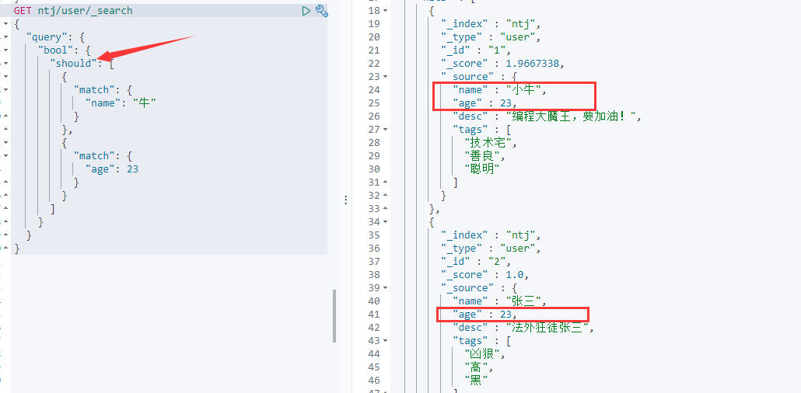
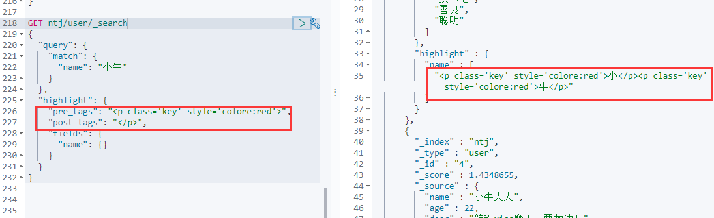

## 1、ELK的安装的准备

### 1.1 ELK的下载地址

ElasticSearch: https://mirrors.huaweicloud.com/elasticsearch/?C=N&O=D

logstash: https://mirrors.huaweicloud.com/logstash/?C=N&O=D

可视化界面elasticsearch-head.https://github.com/mobz/elasticsearch-head

kibana: https://mirrors.huaweicloud.com/kibana/?C=N&O=D

ik分词器 https://github.com/medcl/elasticsearch-analysis-ik

**jdk必须是1.8及以上的版本**。

### 1.2 elk安装 参考

https://blog.csdn.net/mgdj25/article/details/105740191

#### **ElasticSearch**

```tex
安装：
     1 解压，
     2 bin
     3 启动
目录：
     bin 启动文件
     config 配置文件
         log4j2 日志配置文件
         jvm.options java 虚拟机相关的配置
         elasticsearch.yml elasticsearch 的配置文件！ 默认 9200 端口！ 跨域！
         lib 相关jar包
         logs 日志！
         modules 功能模块
         plugins 插件！

```

****

访问http://localhost:9200/


#### **kibana**

1. kibana的国际化设置 yml中设置成zh-CN

2. elasticsearch\config\elasticsearch文件添加

   ```shell
   http.cors.enabled: true
   http.cors.allow-origin: "*" 
   ```

3. 分词器下载后，修改里面的pom文件修改对应es的版本，放到es的plugins的ik目录下（创建一个），放进去，进到ik目录下

   

   

4. 这边特别提醒一下分词的粒度设置，比如一个分词只是将一个词的单体拆分，“李逵哈哈”，可能只是将李逵两个都分开了，并没有分成“李逵”这个词，那就要自己去写字典了

   在ik分词下的config目录下新增一个 “xxx.dic”

   把自己的dic 添加到配置中 IKAnalyzer.cfg.xml中

   增加一个(里面很多用法 都有注释)

   ```xml
   <!-- 用户可以在这扩展自己的用户字典-->  
   <entry key="ext_dict">xxx.dic</entry>
   ```


#### **elasticsearch-head**

1.下载，要和elastic版本对应

2.解压

3.启动 npm run start


4.访问http://localhost:9100


## 2、ES核心概念

```
集群，节点，索引，类型，文档，分片，映射是什么？
```

> elasticsearch是面向文档，关系型数据库和elasticsearch客观的对比！一切都是json

| Relational DB      | Elasticsearch   |
| ------------------ | --------------- |
| 数据库（database） | 索引（indices） |
| 表（tables）       | types           |
| 行（rows）         | documents       |
| 字段（columns）    | fields          |

物理设计：

elasticsearch在后台把每个索引划分成多个分片。每个分片可以在集群中的不同服务器间迁移

逻辑设计：

一个索引类型中，抱哈an多个文档，当我们索引一篇文档时，可以通过这样的一个顺序找到它：索引-》类型-》文档id，通过这个组合我们就能索引到某个具体的文档。注意：`ID不必是整数，实际上它是一个字符串。`

### 文档

> 文档

就是我们的一条条的记录

之前说elasticsearch是面向文档的,那么就意味着索弓和搜索数据的最小单位是文档, elasticsearch中,文档有几个重要属性:

- 自我包含, - -篇文档同时包含字段和对应的值,也就是同时包含key:value !
- 可以是层次型的，-一个文档中包含自文档,复杂的逻辑实体就是这么来的! {就是一 个json对象! fastjson进行自动转换!}
- 灵活的结构,文档不依赖预先定义的模式,我们知道关系型数据库中,要提前定义字段才能使用,在elasticsearch中,对于字段是非常灵活的,有时候,我们可以忽略该字段,或者动态的添加一个新的字段。

尽管我们可以随意的新增或者忽略某个字段,但是,每个字段的类型非常重要,比如一一个年龄字段类型,可以是字符串也可以是整形。因为elasticsearch会保存字段和类型之间的映射及其他的设置。这种映射具体到每个映射的每种类型,这也是为什么在elasticsearch中,类型有时候也称为映射类型。

### 类型

> 类型

类型是文档的逻辑容器,就像关系型数据库一样,表格是行的容器。类型中对于字段的定 义称为映射,比如name映射为字符串类型。我们说文档是无模式的 ,它们不需要拥有映射中所定义的所有字段,比如新增一个字段,那么elasticsearch是怎么做的呢?elasticsearch会自动的将新字段加入映射,但是这个字段的不确定它是什么类型, elasticsearch就开始猜,如果这个值是18 ,那么elasticsearch会认为它是整形。但是elasticsearch也可能猜不对 ，所以最安全的方式就是提前定义好所需要的映射,这点跟关系型数据库殊途同归了,先定义好字段,然后再使用,别整什么幺蛾子。

### 索引

> 索引

就是数据库!

索引是映射类型的容器, elasticsearch中的索引是一个非常大的文档集合。索|存储了映射类型的字段和其他设置。然后它们被存储到了各个分片上了。我们来研究下分片是如何工作的。

**物理设计:节点和分片如何工作**

一个集群至少有一 个节点,而一个节点就是一-个elasricsearch进程 ,节点可以有多个索引默认的,如果你创建索引,那么索引将会有个5个分片( primary shard ,又称主分片)构成的,每一个主分片会有-一个副本( replica shard ,又称复制分片）


上图是一个有3个节点的集群,可以看到主分片和对应的复制分片都不会在同-个节点内,这样有利于某个节点挂掉了,数据也不至于丢失。实际上, 一个分片是- -个Lucene索引, -一个包含倒排索引的文件目录,倒排索引的结构使得elasticsearch在不扫描全部文档的情况下,就能告诉你哪些文档包含特定的关键字。不过,等等,倒排索引是什么鬼?

### 倒排索引

> 倒排索引

elasticsearch使用的是一种称为倒排索引 |的结构,采用Lucene倒排索作为底层。这种结构适用于快速的全文搜索，一个索引由文
档中所有不重复的列表构成,对于每一个词,都有一个包含它的文档列表。 例如,现在有两个文档，每个文档包含如下内容:

```shell
Study every day， good good up to forever  # 文 档1包含的内容
To forever, study every day，good good up  # 文档2包含的内容
12
```

为为创建倒排索引,我们首先要将每个文档拆分成独立的词(或称为词条或者tokens) ,然后创建一一个包含所有不重 复的词条的排序列表,然后列出每个词条出现在哪个文档:

| term    | doc_1 | doc_2 |
| ------- | ----- | ----- |
| Study   | √     | x     |
| To      | x     | x     |
| every   | √     | √     |
| forever | √     | √     |
| day     | √     | √     |
| study   | x     | √     |
| good    | √     | √     |
| every   | √     | √     |
| to      | √     | x     |
| up      | √     | √     |

现在，我们试图搜索 to forever，只需要查看包含每个词条的文档

| term    | doc_1 | doc_2 |
| ------- | ----- | ----- |
| to      | √     | x     |
| forever | √     | √     |
| total   | 2     | 1     |

两个文档都匹配,但是第一个文档比第二个匹配程度更高。如果没有别的条件,现在,这两个包含关键字的文档都将返回。
再来看一个示例,比如我们通过博客标签来搜索博客文章。那么倒排索引列表就是这样的一个结构:

| 博客文章(原始数据) | 博客文章(原始数据) | 索引列表(倒排索引) | 索引列表(倒排索引) |
| ------------------ | ------------------ | ------------------ | ------------------ |
| 博客文章ID         | 标签               | 标签               | 博客文章ID         |
| 1                  | python             | python             | 1，2，3            |
| 2                  | python             | linux              | 3，4               |
| 3                  | linux，python      |                    |                    |
| 4                  | linux              |                    |                    |

如果要搜索含有python标签的文章,那相对于查找所有原始数据而言，查找倒排索引后的数据将会快的多。只需要查看标签这一栏,然后获取相关的文章ID即可。完全过滤掉无关的所有数据,提高效率!

elasticsearch的索引和Lucene的索引对比

在elasticsearch中，索引(库)这个词被频繁使用,这就是术语的使用。在elasticsearch中 ,索引被分为多个分片,每份分片是-个Lucene的索引。**所以一个elasticsearch索引是由多 个Lucene索引组成的**。别问为什么,谁让elasticsearch使用Lucene作为底层呢!如无特指，说起索引都是指elasticsearch的索引。

接下来的一切操作都在kibana中Dev Tools下的Console里完成。基础操作!

### ik分词器

> 什么是IK分词器 ?

分词:即把一-段中文或者别的划分成一个个的关键字,我们在搜索时候会把自己的信息进行分词,会把数据库中或者索引库中的数据进行分词,然后进行一个匹配操作,默认的中文分词是将每个字看成一个词,比如“我爱狂神”会被分为"我",“爱”,“狂”,“神” ,这显然是不符合要求的,所以我们需要安装中文分词器ik来解决这个问题。

如果要使用中文,建议使用ik分词器!

IK提供了两个分词算法: **ik_ smart和ik_ max_ word** ,其中ik_ smart为最少切分, ik_ max_ _word为最细粒度划分!一会我们测试!

什么是IK分词器：

- 把一句话分词
- 如果使用中文：推荐IK分词器
- 两个分词算法：ik_smart（最少切分），ik_max_word（最细粒度划分）

**【ik_smart】测试：**

```shell
GET _analyze
{
  "analyzer": "ik_smart",
  "text": "我是工程师"
}


//输出结果
{
  "tokens" : [
    {
      "token" : "我",
      "start_offset" : 0,
      "end_offset" : 1,
      "type" : "CN_CHAR",
      "position" : 0
    },
    {
      "token" : "是",
      "start_offset" : 1,
      "end_offset" : 2,
      "type" : "CN_CHAR",
      "position" : 1
    },
    {
      "token" : "工程师",
      "start_offset" : 2,
      "end_offset" : 5,
      "type" : "CN_WORD",
      "position" : 2
    }
  ]
}

```

**【ik_max_word】测试：**

```shell
GET _analyze
{
  "analyzer": "ik_max_word",
  "text": "我是工程师"
}
//输出
{
  "tokens" : [
    {
      "token" : "我",
      "start_offset" : 0,
      "end_offset" : 1,
      "type" : "CN_CHAR",
      "position" : 0
    },
    {
      "token" : "是",
      "start_offset" : 1,
      "end_offset" : 2,
      "type" : "CN_CHAR",
      "position" : 1
    },
    {
      "token" : "工程师",
      "start_offset" : 2,
      "end_offset" : 5,
      "type" : "CN_WORD",
      "position" : 2
    },
    {
      "token" : "工程",
      "start_offset" : 2,
      "end_offset" : 4,
      "type" : "CN_WORD",
      "position" : 3
    },
    {
      "token" : "师",
      "start_offset" : 4,
      "end_offset" : 5,
      "type" : "CN_CHAR",
      "position" : 4
    }
  ]
}
```

## 3、命令模式的使用

### 3.1 Rest风格说明

一种软件架构风格，而不是标准。更易于实现缓存等机制

| method | url地址                                         | 描述                   |
| ------ | ----------------------------------------------- | ---------------------- |
| PUT    | localhost:9200/索引名称/类型名称/文档id         | 创建文档(指定文档id)   |
| POST   | localhost:9200/索引名称/类型名称                | 创建文档（随机文档id） |
| POST   | localhost:9200/索引名称/类型名称/文档id/_update | 修改文档               |
| DELETE | localhost:9200/索引名称/类型名称/文档id         | 删除文档               |
| GET    | localhost:9200/索引名称/类型名称/文档id         | 通过文档id查询文档     |
| POST   | localhost:9200/索引名称/类型名称/_search        | 查询所有的数据基础测试 |

#### 创建一个索引

PUT /索引名/类型名(高版本都不写了，都是_doc)/文档id


此时查看elasticsearch里面是否插入成功


那么name这个字段用不用指定类型呢


指定字段的类型properties 就比如sql创表

获得这个规则！可以通过GET请求获得具体的信息


如果自己不设置文档字段类型，那么es会自动给默认类型


#### 修改索引

老办法：修改我们可以还是用原来的PUT的命令，根据id来修改


但是如果没有填写的字段 会重置为空了 ，相当于java接口传对象修改，如果只是传id的某些字段，那其他没传的值都为空了。

新办法：update方法 这种不设置某些值 数据不会丢失

```shell
POST /test3/_doc/1/_update
{
  "doc":{
    "name":"212121"
  }
}

//下面两种都是会将不修改的值清空的

POST /test3/_doc/1
{
    "name":"212121"
}

POST /test3/_doc/1
{
  "doc":{
    "name":"212121"
  }
}
```

#### 删除索引

关于删除索引或者文档的操作

```shell
删除文档
DELETE /test3/_doc/1
删除索引
DELETE /test3
```


通过DELETE命令实现删除，根据你的请求来判断是删除索引还是删除文档记录

使用RESTFUL的风格是我们ES推荐大家使用的！

### 3.2 关于文档的基本操作

1、添加数据

```shell
PUT /ntj/user/1
{
  "name": "小牛大人",
  "age": 23,
  "desc": "编程大魔王，要加油！", 
  "tags": ["技术宅","善良","聪明"]
}

PUT /ntj/user/2
{
  "name": "张三",
  "age": 23,
  "desc": "法外狂徒张三", 
  "tags": ["凶狠","高","黑"]
}

PUT /ntj/user/3
{
  "name": "李四",
  "age": 12,
  "desc": "卖烧饼的屠夫", 
  "tags": ["旅游","唱歌","喝酒"]
}

```


2、查看 GET


3、更新数据 PUT

某个字段不写 则会为空


4、Post _update 推荐这种更新方式

```shell
POST ntj/user/1/_update
{
  "doc": {
    "name": "小牛"
  }
}
```


#### 查询

最简单的搜索是GET

```shell
GET ntj/user/_search?q=name:牛
```


搜索过滤 展示指定的列

```shell
GET ntj/user/_search
{
  "query": {
    "match": {
      "name": "小牛"
    }
  },
  "_source": ["name","desc"]
}
```


#### 排序

```shell
GET ntj/user/_search
{
  "query": {
    "match": {
      "name": "小牛"
    }
  },
  "sort": [
    {
      "age": {
        "order": "desc"
      }
    }
  ]
}
```


#### 分页查询

```shell
GET ntj/user/_search
{
  "query": {
    "match": {
      "name": "小牛"
    }
  },
  "sort": [
    {
      "age": {
        "order": "desc"
      }
    }
  ],
  "from": 0,
  "size": 1
}
```


#### 布尔值查询

> mast (类似MySQL中的and)

```shell
GET ntj/user/_search
{
  "query": {
    "bool": {
      "must": [
        {
          "match": {
            "name": "牛"
          }
        },
        {
          "match": {
            "age": 23
          }
        }
      ]
    }
  }
}
```


> should（or或者的 跟数据库一样）

```shell
GET ntj/user/_search
{
  "query": {
    "bool": {
      "should": [
        {
          "match": {
            "name": "牛"
          }
        },
        {
          "match": {
            "age": 23
          }
        }
      ]
    }
  }
}
```




> must_not (not 不在)


>  条件区间

```shell
GET ntj/user/_search
{
  "query": {
    "bool": {
      "must": [
        {
          "match": {
            "name": "牛"
          }
        }
      ],
      "filter": {
        "range": {
          "age": {
            "gt": 20
          }
        }
      }
    }
  }
}
```


- gt大于
- gte大于等于
- lte小于
- lte小于等于

#### 匹配多条件查询

```shell
GET ntj/user/_search
{
  "query": {
    "match": {
      "tags": "hei 唱歌"
    }
  }
}
```


#### 精确查询

term查询是直接通过倒排索引指定的词条进程精确查找的！

**关于分词**：

- term，直接查询精确的
- match，会使用分词器解析

**两个类型text  keyword**

text可以被分割


keyword 不可以分割


> 精确查询多个值


#### 高亮查询


```shell
GET ntj/user/_search
{
  "query": {
    "match": {
      "name": "小牛"
    }
  },
  "highlight": {
    "fields": {
      "name": {}
    }
  }
}
```


> 自定义高亮的格式




### 4、集成SpringBoot

### 4.1 引入依赖包

创建一个springboot的项目 同时勾选上`springboot-web`的包以及`Nosql的elasticsearch`的包

注意下spring-boot的parent包内的依赖的es的版本是不是你对应的版本

不是的话就在pom文件下写个properties的版本

```xml
<!--这边配置下自己对应的版本-->
<properties>
    <java.version>1.8</java.version>
    <elasticsearch.version>7.6.1</elasticsearch.version>
</properties>

```

### 4.2 注入RestHighLevelClient 客户端

```java
@Configuration
public class ElasticSearchClientConfig {
    @Bean
    public RestHighLevelClient restHighLevelClient(){
        RestHighLevelClient client = new RestHighLevelClient(
                RestClient.builder(new HttpHost("127.0.0.1",9200,"http"))
        );
        return client;
    }
}
```

### 4.3 索引的增、删、是否存在

```java
//测试索引的创建
@Test
void testCreateIndex() throws IOException {
    //1.创建索引的请求
    CreateIndexRequest request = new CreateIndexRequest("java_index");
    //2客户端执行请求，请求后获得响应
    CreateIndexResponse response = client.indices().create(request, RequestOptions.DEFAULT);
    System.out.println(response);
}

//测试索引是否存在
@Test
void testExistIndex() throws IOException {
    //1.创建索引的请求
    GetIndexRequest request = new GetIndexRequest("java_index");
    //2客户端执行请求，请求后获得响应
    boolean exist =  client.indices().exists(request, RequestOptions.DEFAULT);
    System.out.println("测试索引是否存在-----"+exist);
}

//删除索引
@Test
void testDeleteIndex() throws IOException {
    DeleteIndexRequest request = new DeleteIndexRequest("java_index");
    AcknowledgedResponse delete = client.indices().delete(request,RequestOptions.DEFAULT);
    System.out.println("删除索引--------"+delete.isAcknowledged());
}
```

### 4.4 文档的操作

```java
  //添加文档
    @Test
    void testDocument() throws IOException {
        //创建对象
        User user = new User("牛牛", 3);
        //创建请求
        IndexRequest request = new IndexRequest("java_index");
        //规则 put/java_index/_doc/1
        request.id("1");
        request.timeout(TimeValue.timeValueSeconds(1));
        request.timeout("1s");

        //将我们的数据放入请求 json
        IndexRequest source = request.source(JSON.toJSONString(user), XContentType.JSON);
        //客户端发送请求,获取响应的结果
        IndexResponse index = restHighLevelClient.index(source, RequestOptions.DEFAULT);
        System.out.println(index.toString());
        System.out.println(index.status());
    }

    @Test
    void testExistDocument() throws IOException {
        //测试文档的 没有index
        GetRequest request= new GetRequest("java_index","1");
        //没有indices()了
        boolean exist = restHighLevelClient.exists(request, RequestOptions.DEFAULT);
        System.out.println("测试文档是否存在-----"+exist);
    }

    //测试获取文档
    @Test
    void testGetDocument() throws IOException {
        GetRequest request = new GetRequest("java_index", "1");
        GetResponse response = restHighLevelClient.get(request, RequestOptions.DEFAULT);
        System.out.println("测试获取文档-----" + response.getSourceAsString());
        System.out.println("测试获取文档-----" + response);
    }
    /**
     * 结果：
     * 测试获取文档-----{"age":3,"name":"牛牛"}
     * 测试获取文档-----{"_index":"java_index","_type":"_doc","_id":"1","_version":1,"_seq_no":0,"_primary_term":1,"found":true,"_source":{"age":3,"name":"牛牛"}}
     */
    @Test
    void testUpdateDocument() throws IOException {
        User user = new User("李逍遥", 55);
        //修改是id为1的
        UpdateRequest request = new UpdateRequest("java_index", "1");
        request.timeout("1s");
        request.doc(JSON.toJSONString(user), XContentType.JSON);

        UpdateResponse response = restHighLevelClient.update(request, RequestOptions.DEFAULT);
        System.out.println("测试修改文档-----" + response);
        System.out.println("测试修改文档-----" + response.status());
        /**
         * 结果
         * 测试修改文档-----UpdateResponse[index=java_index,type=_doc,id=1,version=2,seqNo=1,primaryTerm=1,result=updated,shards=ShardInfo{total=2, successful=1, failures=[]}]
         * 测试修改文档-----OK
         */
    }
    //测试删除文档
    @Test
    void testDeleteDocument() throws IOException {
        DeleteRequest request= new DeleteRequest("java_index","1");
        request.timeout("1s");
        DeleteResponse response = restHighLevelClient.delete(request, RequestOptions.DEFAULT);
        System.out.println("测试删除文档------"+response.status());
        /*
        测试删除文档------OK
         */
    }
    //测试批量添加文档
    @Test
    void testBulkAddDocument() throws IOException {
        ArrayList<User> userlist=new ArrayList<User>();
        userlist.add(new User("xn1",5));
        userlist.add(new User("xn2",6));
        userlist.add(new User("xn3",40));
        userlist.add(new User("xn4",25));
        userlist.add(new User("xn5",15));
        userlist.add(new User("xn6",35));

        //批量操作的Request
        BulkRequest request = new BulkRequest();
        request.timeout("1s");

        //批量处理请求
        for (int i = 0; i < userlist.size(); i++) {
            request.add(
                    new IndexRequest("java_index")
                            .id(""+(i+1))
                            .source(JSON.toJSONString(userlist.get(i)),XContentType.JSON)
            );
        }
        BulkResponse response = restHighLevelClient.bulk(request, RequestOptions.DEFAULT);
        //response.hasFailures()是否是失败的
        System.out.println("测试批量添加文档-----"+response.hasFailures());
//        结果:false为成功 true为失败
//        测试批量添加文档-----false
    }
    //测试查询文档
    @Test
    void testSearchDocument() throws IOException {
        SearchRequest request = new SearchRequest("java_index");
        //构建搜索条件
        SearchSourceBuilder sourceBuilder = new SearchSourceBuilder();
        //设置了高亮
        sourceBuilder.highlighter();
        //term name为cyx1的
        TermQueryBuilder termQueryBuilder = QueryBuilders.termQuery("name", "xn1");
        sourceBuilder.query(termQueryBuilder);
        sourceBuilder.timeout(new TimeValue(60, TimeUnit.SECONDS));

        request.source(sourceBuilder);
        SearchResponse response = restHighLevelClient.search(request, RequestOptions.DEFAULT);

        System.out.println("测试查询文档-----"+JSON.toJSONString(response.getHits()));
        System.out.println("=====================");
        for (SearchHit documentFields : response.getHits().getHits()) {
            System.out.println("测试查询文档--遍历参数--"+documentFields.getSourceAsMap());
        }
        /**
         * 测试查询文档-----{"fragment":true,"hits":[{"fields":{},"fragment":false,"highlightFields":{},"id":"1","matchedQueries":[],"primaryTerm":0,"rawSortValues":[],"score":1.540445,"seqNo":-2,"sortValues":[],"sourceAsMap":{"name":"xn1","age":5},"sourceAsString":"{\"age\":5,\"name\":\"xn1\"}","sourceRef":{"fragment":true},"type":"_doc","version":-1}],"maxScore":1.540445,"totalHits":{"relation":"EQUAL_TO","value":1}}
         * =====================
         * 测试查询文档--遍历参数--{name=xn1, age=5}
         * 2020-10-26 20:06:38.218  INFO 16292 --- [extShutdownHook] o.s.s.concurrent.ThreadPoolTaskExecutor  : Shutting down ExecutorService 'applicationTaskExecutor'
         */

    }

```

### 实战京东搜索

导入vue.min.js与axios.min.js

**爬取数据**

```java
@Component
public class HtmlParseUtil {
    public List<Content> parseJD(String keywords) throws IOException {
        //获取资源 https://search.jd.com/Search?keyword=java
        String url = "https://search.jd.com/Search?keyword="+keywords;
        //解析网页(Jsoup返回的document就是浏览器Document对象)
        Document document = Jsoup.parse(new URL(url), 30000);
        Element element = document.getElementById("J_goodsList");
        Elements elements = element.getElementsByTag("li");
        ArrayList<Content> goodslist = new ArrayList<>();
        //获取元素中的内容，这里的el 就是每个li标签
        for (Element el : elements) {
            //不显示图片是因为 网站图片是懒加载 等页面渲染了 才会将图片显示出来
            String img = el.getElementsByTag("img").eq(0).attr("data-lazy-img");
            String price = el.getElementsByClass("p-price").eq(0).text();
            String title = el.getElementsByClass("p-name").eq(0).text();
            Content content = new Content();
            content.setImg(img);
            content.setTitle(title);
            content.setPrice(price);
            goodslist.add(content);
        }
        return goodslist;
    }
}

```

**写入ElasticSearch**

```java
@Service
public class ContentService {
    @Autowired
    private RestHighLevelClient restHighLevelClient;

    //1、解析数据放到es索引中
    public Boolean parseContent(String keywords) throws Exception{
        List<Content> contents = new HtmlParseUtil().parseJD(keywords);
        //把查询道数据导入es中
        BulkRequest bulkRequest = new BulkRequest();
        bulkRequest.timeout("2m");
        for (int i = 0; i < contents.size(); i++) {
            bulkRequest.add(
                    new IndexRequest("jd_goods")
                    .source(JSON.toJSONString(contents.get(i)),XContentType.JSON)
            );
        }
        BulkResponse bulk = restHighLevelClient.bulk(bulkRequest, RequestOptions.DEFAULT);
        return !bulk.hasFailures();
    }
    //2、获取这些数据实现搜索功能
    public List<Map<String,Object>> searchPage(String keyword,
                                               int pageNo,
                                               int pageSize) throws IOException {
        if (pageNo <= 1){
            pageNo = 1;
        }
        //条件查询
        SearchRequest searchRequest = new SearchRequest("jd_goods");
        SearchSourceBuilder sourceBuilder = new SearchSourceBuilder();

        //分页
        sourceBuilder.from(pageNo);
        sourceBuilder.size(pageSize);

        //精准匹配
        TermQueryBuilder termQueryBuilder = QueryBuilders.termQuery("title", keyword);
        sourceBuilder.query(termQueryBuilder);
        sourceBuilder.timeout(new TimeValue(60, TimeUnit.SECONDS));

        //执行搜索
        searchRequest.source(sourceBuilder);
        SearchResponse searchResponse = restHighLevelClient.search(searchRequest, RequestOptions.DEFAULT);

        //解析结果

        ArrayList<Map<String,Object>> list = new ArrayList<>();
        for (SearchHit documentFields : searchResponse.getHits().getHits()) {
            list.add(documentFields.getSourceAsMap());
        }
        return list;
    }

    //3、高亮搜索
    public List<Map<String,Object>> searchHighlighterPage(String keyword,
                                               int pageNo,
                                               int pageSize) throws IOException {
        if (pageNo <= 1) {
            pageNo = 1;
        }
            //条件查询
            SearchRequest searchRequest = new SearchRequest("jd_goods");
            SearchSourceBuilder sourceBuilder = new SearchSourceBuilder();

            //分页
            sourceBuilder.from(pageNo);
            sourceBuilder.size(pageSize);

            //精准匹配
            TermQueryBuilder termQueryBuilder = QueryBuilders.termQuery("title", keyword);
            sourceBuilder.query(termQueryBuilder);
            sourceBuilder.timeout(new TimeValue(60, TimeUnit.SECONDS));


            //高亮
            HighlightBuilder highlightBuilder = new HighlightBuilder();
            highlightBuilder.field("title");
            highlightBuilder.requireFieldMatch(false);//一条结果有多个关键字 选择一个高亮
            highlightBuilder.preTags("<span style='color:red'>");
            highlightBuilder.postTags("</span>");
            sourceBuilder.highlighter(highlightBuilder);
            //执行搜索
            searchRequest.source(sourceBuilder);
            SearchResponse searchResponse = restHighLevelClient.search(searchRequest, RequestOptions.DEFAULT);


            //解析结果
            ArrayList<Map<String, Object>> list = new ArrayList<>();

            for (SearchHit documentFields : searchResponse.getHits().getHits()) {
                Map<String, HighlightField> highlightFields = documentFields.getHighlightFields();
                HighlightField title = highlightFields.get("title");
                Map<String, Object> sourceAsMap = documentFields.getSourceAsMap();//原来的结果
                //解析高亮地字段，将原来的字段换为高亮字段即可。
                if (title != null) {
                    Text[] fragments = title.fragments();
                    String n_title = "";
                    for (Text text : fragments) {
                        n_title += text;
                    }
                    sourceAsMap.put("title", n_title);//高亮字段替换
                }
                list.add(sourceAsMap);
            }
            return list;
        }

}
```

**Controller层**

```java
@RestController
public class ContentController {
    @Autowired
    private ContentService contentService;
    //爬取数据
    @GetMapping("/parse/{keyword}")
    public Boolean parse(@PathVariable("keyword") String keyword) throws Exception {
        return contentService.parseContent(keyword);

    }
    
    //查询数据
  @GetMapping("/search/{keyword}/{pageNo}/{pageSize}")
    public List<Map<String,Object>> search(@PathVariable("keyword") String keyword,
                                           @PathVariable("pageNo") int pageNo,
                                           @PathVariable("pageSize") int pageSize) throws IOException {

       return contentService.searchHighlighterPage(keyword,pageNo,pageSize);
    }

}
```

**结果**

